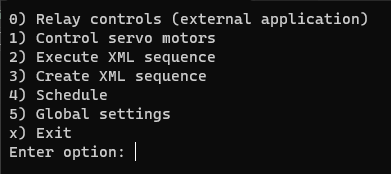
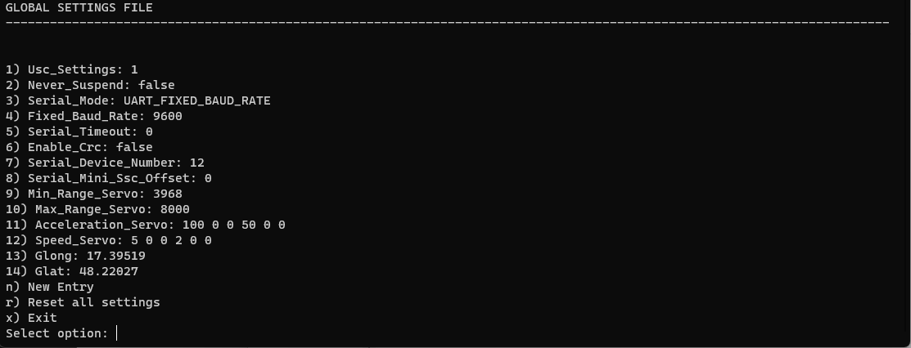

# CoverControl

**CoverControl** is a CLI application that allows for automated control for a remote telescope.

Application is operated in a CLI form on an interactive basis with main menu and other submenus being provided at any time. It aims to provide a one-stop environment for operating the telescope apparatus, and it enables executing custom workloads at custom times.

Let us go over each option of the main menu:

## 0) Relay Control

This enables executing an external application that enables the relay module. Author of this application has not been able to find any drivers of libraries they could use programmatically within the application, so they have resorted to providing a path to an external application that the clients have access to. Upon first launch, user is asked to provide a path to this external application, and future launches will launch the external application automatically.

## 1) Control servo motors

Enables control of specific servo motors on individual channels. It operates on a min/max scale that can be manually customized in the global settings (the range depends on the hardware in use). Furthermore, user can specify the speed and acceleration parameters (see 5), with which these movements will be done.

## 2) Execute XML sequence

Enables execution of an arbitrary sequence provided within an XML file. User provides a path to the XML file, so that the instructions are loaded in and executed accordingly. User can specify frames for Open and Close sequences, where each frame has a name, execution length in milliseconds, and states for all of the channels. Acceleration and speed are subject to global settings that can be customized (see 5).

<strike>

## 3) Create XML sequence

User can create custom sequences that they can later execute. Each sequence is a succession of frames whose execution order is subject to order of user input. Each frame has a defined length in milliseconds and the states that all of the relay channels should follow. Created XML files are compatible with [Pololu Maestro Control Center](https://www.pololu.com/docs/0J40/4).

</strike>

## 3) Schedule

User can specify a workload to be executed upon sunset or sunrise (which are dynamically calculated based on computer's time), or they can schedule to run certain workloads at a custom time of the day they have specified. This schedule runs intelligently, meaning it automatically picks up at the nearest instance when the time of the day will occur, either on the same day or the next day compared to computer time.

## 4) Global Settings

This contains all the values used throughout the application in XML files, but they also allow customization of servo acceleration and speed, as well as specifying custom ranges for the hardware in question (how far a piece of equipment may move, which is subject to a hardware in use). User can also add custom properties or reset all of the values to their defaults. Lastly, they can use it to customize the longitude and latitude of their telescope, which are both used for calculating sunrise and sunset times dynamically. Before first use it is necessary to re

---

# CoverControl

**CoverControl** je konzolová aplikácia, ktorá umožňuje automatizované ovládanie vzdialeného teleskopu.

Aplikácia sa ovláda vo forme CLI na interaktívnej báze, pričom hlavné menu a ďalšie podmenu sa poskytujú kedykoľvek. Jej cieľom je poskytnúť jednotné prostredie na obsluhu prístroja teleskopu a umožňuje vykonávať vlastné pracovné úlohy vo vlastnom čase.

Prejdime si jednotlivé možnosti hlavnej ponuky:

## 0) Ovládanie relé

Umožňuje spustenie externej aplikácie, ktorá zapne reléový modul. Autorovi tejto aplikácie sa nepodarilo nájsť žiadne ovládače knižníc, ktoré by mohol programovo použiť v rámci aplikácie, preto sa uchýlil k poskytnutiu cesty k externej aplikácii, ku ktorej majú klienti prístup. Pri prvom spustení je používateľ požiadaný o zadanie cesty k tejto externej aplikácii a pri ďalších spusteniach sa externá aplikácia spustí automaticky.

## 1) Ovládanie servomotorov

Umožňuje ovládanie konkrétnych servomotorov na jednotlivých kanáloch. Pracuje na stupnici min/max, ktorú možno manuálne prispôsobiť v globálnych nastaveniach (rozsah závisí od použitého hardvéru). Okrem toho môže používateľ určiť parametre rýchlosti a zrýchlenia (pozri 5), s ktorými sa budú tieto pohyby vykonávať.

## 2) Vykonanie sekvencie XML

Umožňuje vykonať ľubovoľnú sekvenciu zadanú v rámci súboru XML. Používateľ zadá cestu k súboru XML, aby sa do neho načítali a vykonali príslušné inštrukcie. Používateľ môže určiť rámce pre sekvencie Otvoriť a Zatvoriť, pričom každý rámec má názov, dĺžku vykonávania v milisekundách a stavy pre všetky kanály. Zrýchlenie a rýchlosť podliehajú globálnym nastaveniam, ktoré možno prispôsobiť (pozri časť 5).

## 3) Vytvorenie sekvencie XML

Používateľ môže vytvárať vlastné sekvencie, ktoré môže neskôr vykonávať. Každá sekvencia je postupnosť snímok, ktorých poradie vykonávania podlieha poradiu zadávaných údajov používateľom. Každý rámec má definovanú dĺžku v milisekundách a stavy, ktoré by mali nasledovať všetky reléové kanály. Vytvorené súbory XML sú kompatibilné s [Pololu Maestro Control Center](https://www.pololu.com/docs/0J40/4).

## 4) Plán

Používateľ môže určiť pracovnú záťaž, ktorá sa má vykonať pri západe alebo východe slnka (ktoré sa dynamicky vypočítajú na základe času počítača), alebo môže naplánovať spustenie určitých pracovných záťaží vo vlastnom čase dňa, ktorý určil. Tento plán sa vykonáva inteligentne, čo znamená, že sa automaticky vyberie v najbližšom prípade, keď nastane čas dňa, buď v ten istý deň, alebo nasledujúci deň v porovnaní s časom počítača.

## 5) Globálne nastavenia

Obsahujú všetky hodnoty používané v celej aplikácii v súboroch XML, ale umožňujú aj prispôsobenie zrýchlenia a rýchlosti servopohonov, ako aj určenie vlastných rozsahov pre príslušný hardvér (ako ďaleko sa môže zariadenie pohybovať, čo je podmienené používaným hardvérom). Používateľ môže tiež pridať vlastné vlastnosti alebo resetovať všetky hodnoty na ich predvolené hodnoty. Nakoniec ho môžu použiť na prispôsobenie zemepisnej dĺžky a šírky svojho teleskopu, ktoré sa používajú na dynamický výpočet času východu a západu Slnka.

